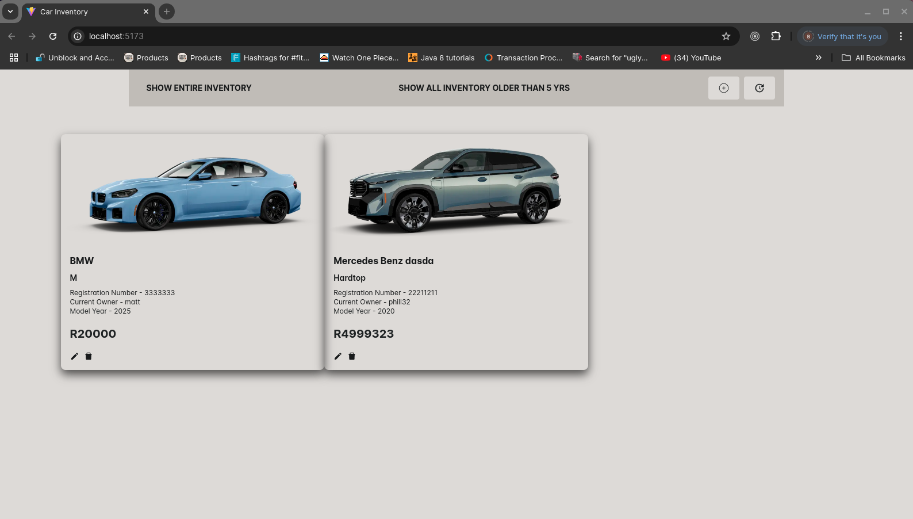
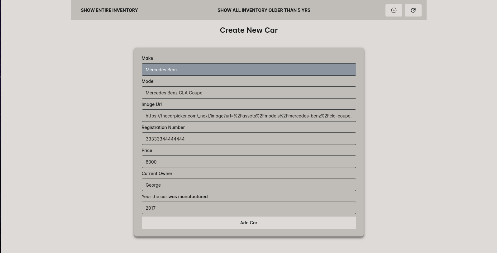
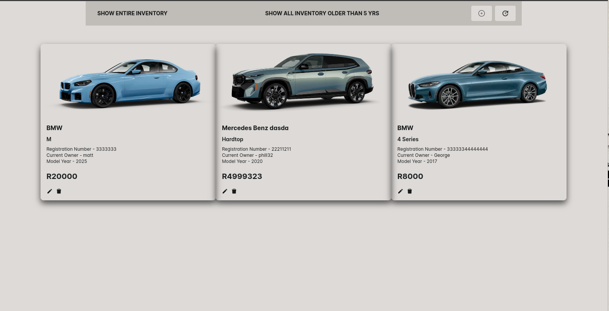
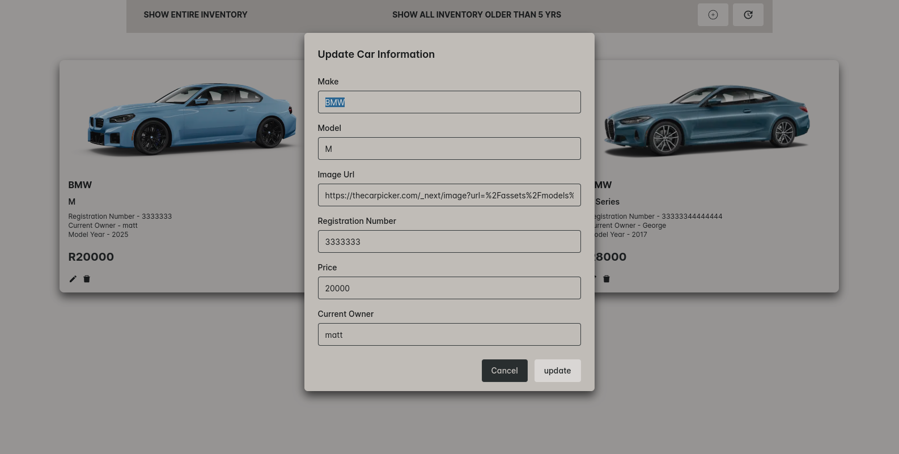
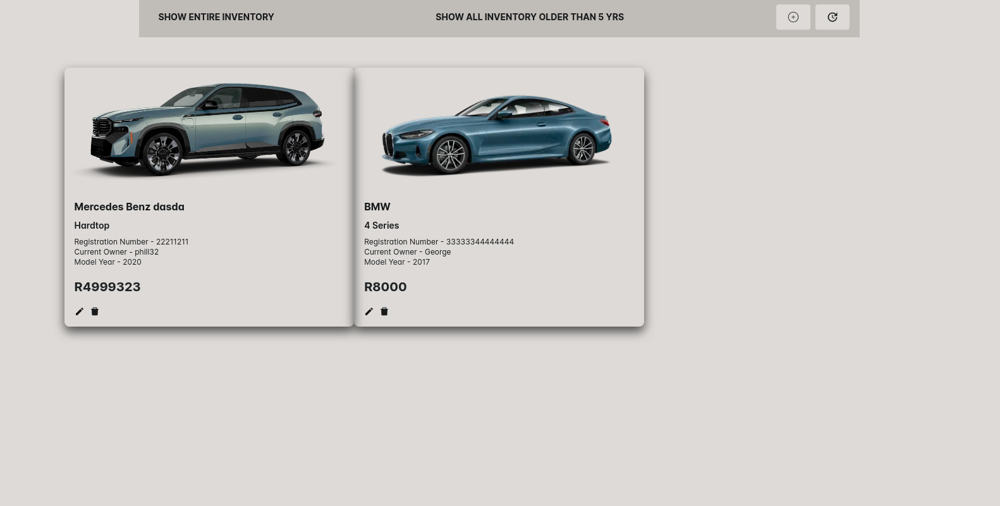
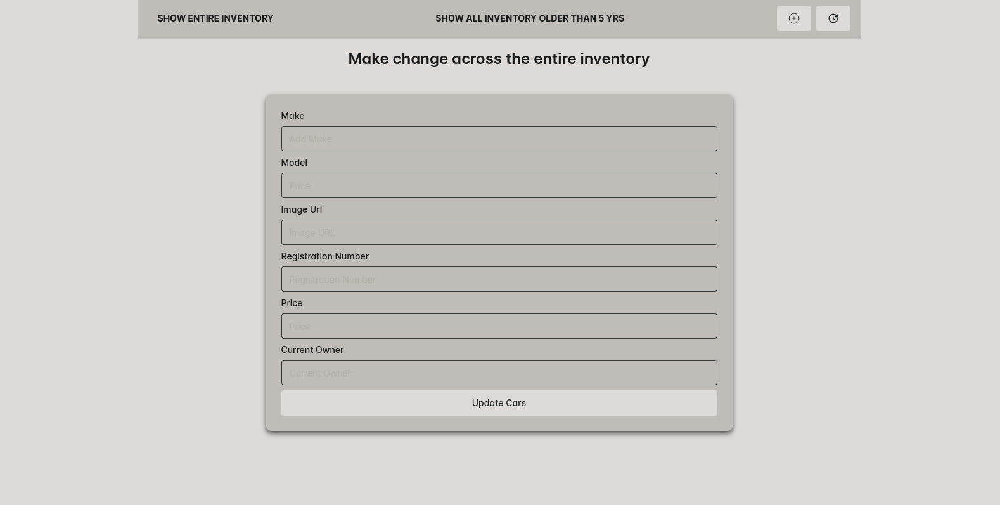

# Car Inventory
# Project Description
This is a platform where users can add, update, edit and delete car entries. All items are stored in a data base.

# The technologies used in this projects are as follows:
* React js
* Boostrap
* Chakra-ui
* React router-dom
* Zustand
* Vite
* Dotenv
* Express
* Mongoose
* Nodemon

# **How to Install and Run Car Inventory application**
* Download and extract file and open the file it IDE of choice
* Open terminal and cd frontend
* npm install
* cd backend
* npm install
* in frontend npm run dev to launch
* in backend npm run dev to launch 

# 
# 
# 
# 
# 
# 
